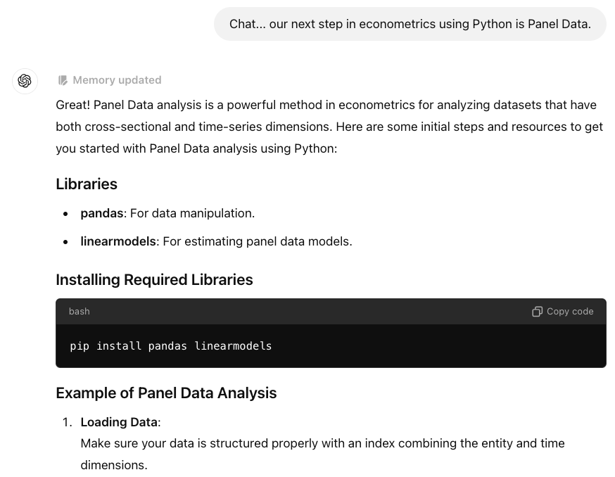
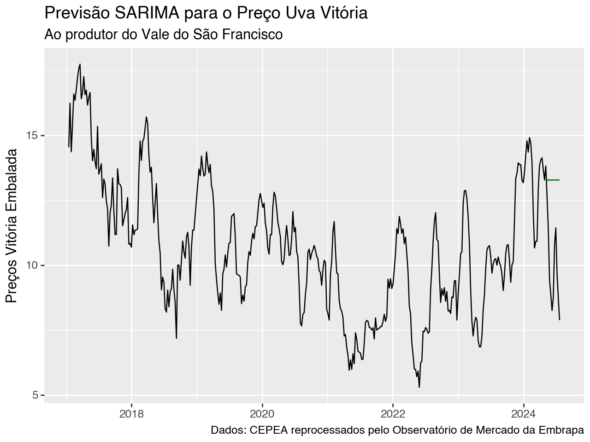

class: center

```{r setup, include=FALSE}
# Dependências dos slides/aula
library(knitr)          # CRAN v1.33
library(rmarkdown)      # CRAN v2.10
library(xaringan)       # CRAN v0.22
library(xaringanthemer) # CRAN v0.3.0
library(xaringanExtra)  # [github::gadenbuie/xaringanExtra] v0.5.5
library(RefManageR)     # CRAN v1.3.0
library(ggplot2)        # CRAN v3.3.5
library(fontawesome)    # [github::rstudio/fontawesome] v0.1.0
library(pagedown)

# Opções de chunks
options(htmltools.dir.version = FALSE)
knitr::opts_chunk$set(
  echo       = FALSE,
  warning    = FALSE,
  message    = FALSE,
  fig.retina = 3,
  fig.width  = 11,
  fig.asp    = 0.618,
  out.width  = "100%",
  fig.align  = "center",
  comment    = "#"
  )

# Cores para gráficos
colors <- c(
  blue       = "#282f6b",
  red        = "#b22200",
  yellow     = "#eace3f",
  green      = "#224f20",
  purple     = "#5f487c",
  orange     = "#b35c1e",
  turquoise  = "#419391",
  green_two  = "#839c56",
  light_blue = "#3b89bc",
  gray       = "#666666"
  )
```

```{r xaringan, echo=FALSE}
# Tema da apresentação
xaringanthemer::style_mono_light(
  base_color                      = unname(colors["blue"]),
  title_slide_background_image    = params$logo_slides, 
  title_slide_background_size     = 12,
  title_slide_background_position = "bottom 10px right 20px",
  title_slide_background_color    = "white",
  title_slide_text_color          = unname(colors["blue"]),
  footnote_position_bottom        = "15px"
  )

# Opções extras do tema
xaringanExtra::use_progress_bar(
  color    = colors["blue"], 
  location = "bottom"
  )
xaringanExtra::use_extra_styles(
  hover_code_line         = TRUE,
  mute_unhighlighted_code = FALSE
  )
xaringanExtra::use_panelset()
```

```{css, echo=FALSE}
pre {
  white-space: pre-wrap;
  overflow-y: scroll !important;
  max-height: 45vh !important;
  overflow-x: auto;
  max-width: 100%;
}
```

```{r load_refs, echo=FALSE, eval=params$references}
# Configuração de citações
RefManageR::BibOptions(
  check.entries = FALSE,
  bib.style     = "authoryear",
  cite.style    = "authoryear",
  style         = "markdown",
  hyperlink     = FALSE,
  dashed        = FALSE
  )
if(params$references){
  temp_refbib <- tempdir()
  download.file(
    url      = params$references_path, 
    destfile = paste0(temp_refbib, "/references.bib"), 
    mode     = "wb"
    )
  myBib <- RefManageR::ReadBib(paste0(temp_refbib, "/references.bib"), check = FALSE)
  }

# Como citar?
# RefManageR::TextCite(myBib, "id_da_citacao")
```

```{r utils, echo=FALSE}
# Função que pega um arquivo .Rmd, condicionalmente o renderiza, 
# e embute o conteúdo do mesmo formatado como Markdown puro 
# no output do documento atual
print_rmd <- function(file, encoding = "UTF-8", render = TRUE){
  if(render){rmarkdown::render(input = file, quiet = TRUE)}
  rmd <- readLines(con = file, encoding = encoding)
  cat("```md\n")
  cat(rmd, sep = "\n")
  cat("```\n")
}
```


## YAHOO E OS PRIMÓRDIOS DAS NUVENS

```{r, echo=FALSE, out.width="95%"}

```

---
class: center
## MÍDIAS QUE FICARAM OBSOLETAS

```{r, echo=FALSE, out.width="60%"}

```

---
class: center
## FERRAMENTAS QUE FICARÃO OBSOLETAS EM BREVE

```{r, echo=FALSE, out.width="70%"}

```

---
class: center
## PARTE DOS QUE PODEM FICAR OBSOLETOS...`r emo::ji("stuck_out_tongue_winking_eye")`

```{r, echo=FALSE, out.width="85%"}

```

---
class: center
## O MERCADO DE TRABALHO E A IA

.pull-left[

```{r, echo=FALSE, out.width="100%"}

```

]

.pull-right[

- "O mercado está cada vez mais demandante. 

Não vamos nem falar em AI [Inteligência Artificial]. 

A AI pode ser complementar ou substituta. 

Se você tiver uma mão de obra bem qualificada, ela é complementar. 

Se você tiver uma mão de obra fraca, ela é substituta." (BARBOSA FILHO, F. DE H. - Pesquisador do Ibre/FGV)

]

---
class: center
## AS PRINCIPAIS FERRAMENTAS DO ECONOMISTA

.pull-left[

- Modelos de Equilíbrio Geral Computável 

```{r, echo=FALSE, out.width="60%"}

```

- No Brasil, a USP com o prof. Eduardo Haddad, ESALQ-USP com o prof. Joaquim Bento e a FGV/UFV com o prof. Angelo Gurgel são os maiores expoentes.
]

.pull-right[

- Modelos de Regressão

- Regressão Linear com dados de seção cruzada;

- Séries Temporais para previsão 

- Séries Temporais com dados de Alta frequência ou series temporais irregulares

- Dados em Painel

- Modelos de Inferência Causal e contrafactuais: DID, PSM, IV. 

- No Brasil, estes modelos estão bem disseminados. 

]

---
class: center

### AS PRINCIPAIS FERRAMENTAS DO ECONOMISTA

.pull-left[

- Os Programas de Computador 

```{r, echo=FALSE, out.width="75%"}

```

- No momento, R ou Python passa a ser a dúvida de qual programa deve ser utilizado. Stata, SAS, SPSS, Eviews perdem espaço rápidamente dentre os economistas. 

]

.pull-right[

- Além do programa R ou Python, ainda é preciso agora escolher uma IDE (Integrated Development Environment) para se trabalhar. 

```{r, echo=FALSE, out.width="75%"}

```

]

---
class: center

### INTELIGÊNCIA ARTIFICAL (IA) COMO UMA FERRAMENTA

.pull-left[

- Para a IBM (2024), "IA é uma tecnologia que permite que computadores e máquinas simulem a capacidade de resolução de problemas e a inteligência humana. Por si só ou combinada com outras tecnologias (como sensores, geolocalização e robótica) a IA pode realizar tarefas que, de outro modo, exigiriam a inteligência ou intervenção humana".   

- IA é um conceito mais amplo, para qualquer técnica que permita às máquinas imitar ou replicar a inteligência humana. 

- Se subdivide em diversas abordagens: a) Symbolic AI; b) Expert Systems (anos 70 e 80 do século XX); c) Evolutionary Algorithms (anos 90); d) Machine (anos 2000) e Deep Learning (anos 2010); e) IA Generativa (presente momento).

]

.pull-right[

- A IA passa a ser relevantes para os economistas a medida que:

a) Melhora a nossa condição de analisar grandes conjuntos de dados, tomar decisões e fazer previsões;

b) Automatiza muitas tarefas;

c) Realiza análise de perfil de consumidor personalizada;

d) Faz pesquisas, cria cenários e conteúdos. 

Leitura recomendada:

Agrawal, A., Gans, J., & Goldfarb, A. (Eds.). (2019). The Economics of Artificial Intelligence: An Agenda. University of Chicago Press.

]

---
class: center

### INTELIGÊNCIA ARTIFICAL (IA) COMO UMA FERRAMENTA

.pull-left[

- Em relação aos modelos de ML (Machine Learning) e DL (deep learning) são considerados um subconjunto da IA dado que permimtem que o sistema aprenda com os dados, identifique padrões e tome decisões com o mínimo de intervenção humana. 

- Os modelos aprendem com os dados e melhoram o seu desempenho a medida que recebem novos dados. 

- A automatização das tarefas permite que decisões sejam tomadas com maior rapidez e precisão na comparação com os humanos. 

- Resolvem problemas mais complexos.

]

.pull-right[

- Entre os modelos de ML e DL mais usados atualmente, tem-se a divisão entre os modelos de aprendizagem supervisionada e não supervisionada. 

- No caso dos modelos de aprendizagem supervisionada, tem-se:

a) Modelo Logit para classificar indivíduos;

b) Árvores de decisão e Random Forests;

c) Support Vector Machine

d) KNN (K vizinhos mais próximos)

e) Gradient Boosting Machines (GBM)

]

---
class: center

### INTELIGÊNCIA ARTIFICAL (IA) COMO UMA FERRAMENTA

.pull-left[

- No caso dos Modelos Não Supervisionados, tem-se:

a) Cluster pelo método das K-médias

b) Cluster Hierárquico

c) Análise de componentes principais

d) Redes Neurais

]

.pull-right[

```{r, echo=FALSE, out.width="85%"}

```

]

---
class: center

### INTELIGÊNCIA ARTIFICAL (IA) COMO UMA FERRAMENTA

.pull-left[

- Contudo, no período mais recente, é IA generativa que tem mais chamado atenção de todos. 

```{r, echo=FALSE, out.width="75%"}

```

- IA generativa é fascinante por ser capaz de criar algo novo e inesperado. É baseada em algoritmos de Machine Learning que são treinados usando enormes conjuntos de dados. Por exemplo, um algoritmo de Machine Learning pode ser treinado usando milhões de imagens de paisagens, o que permite que ele crie suas próprias imagens de paisagens.


]

.pull-right[

- Os tipos mais conhecidos de IA generativa são baseados em grandes modelos de linguagem (LLMs), onde analisam, parafraseiam, editam, traduzem e geram texto, imagens e outros tipos de conteúdo. 

- LLMs são algoritmos estatísticos treinados em enormes conjuntos de dados de linguagem natural, como textos da Internet, livros, artigos de periódicos e revistas. Ao processar esses dados, os LLMs podem aprender a estimar probabilidades associadas a possíveis respostas ao texto e podem classificar as respostas de acordo com a probabilidade de serem julgadas corretas pelos seres humanos. 

]

---
class: center

### INTELIGÊNCIA ARTIFICAL (IA) COMO UMA FERRAMENTA

.pull-left[

- Existe um conjunto de questões éticas relacionadas com a IA. Assim, sugestões de leitura são: 

Resnik, D.B., Hosseini, M. The ethics of using artificial intelligence in scientific research: new guidance needed for a new tool. AI Ethics (2024). https://doi.org/10.1007/s43681-024-00493-8

Chetwynd E. Ethical Use of Artificial Intelligence for Scientific Writing: Current Trends. J Hum Lact. 2024 May;40(2):211-215. doi: 10.1177/08903344241235160. 

O que é a ética na IA? (https://www.ibm.com/br-pt/topics/ai-ethics)


]

.pull-right[

- Contudo, o objetivo aqui é mostrar como a IA pode ajudar a aumentar a nossa produtividade, como pode acelerar a nossa curva de aprendizagem, como ela pode nos ajudar a poupar tempo com tarefas necessárias, mas que não são as mais importantes para o trabalho do economista. 

- Importante, antes de tudo, falar sobre o que se denomina de **engenharia de prompt**, ou seja, como vamos perguntar para a IA? Assim, é preciso aprender a se comunicar com as IA generativas. Se fizer perguntas de forma incorreta, as respostas serão sem sentido ou generalistas demais.  

]


---
class: center

### INTELIGÊNCIA ARTIFICAL (IA) COMO UMA FERRAMENTA

.pull-left[

- O prompt é o input que vamos oferecer para a IA generativa com o objetivo de receber um output. 

```{r, echo=FALSE, out.width="100%"}

```

- Acima se tem prompts bastante diretos, usados para obter respostas específicas.

]

.pull-right[

- Contudo, não se trata apenas de fazer a pergunta certa. O processo de construir prompts de maneira efetiva para gerar resultados melhores envolve etapas: 

a) Definir o objetivo

b) Criar rascunho inicial de prompt

c) Testar o prompt

d) Analisar a resposta

e) Refinar o prompt

f) Iterar até alcançar o resultado desejado

]


---
class: center

### INTELIGÊNCIA ARTIFICAL (IA) COMO UMA FERRAMENTA

.pull-left[

- A IA também vai aprendendo através da interação. 

```{r, echo=FALSE, out.width="100%"}

```

]

.pull-right[

```{r, echo=FALSE, out.width="95%"}

```

```{r, echo=FALSE, out.width="95%"}

```

]

---
class: center

### INTELIGÊNCIA ARTIFICAL (IA) COMO UMA FERRAMENTA

.pull-left[

```{r, echo=FALSE, out.width="92%"}

```

```{r, echo=FALSE, out.width="92%"}

```

]

.pull-right[

```{r, echo=FALSE, out.width="100%"}

```

]

---
class: center

### INTELIGÊNCIA ARTIFICAL (IA) COMO UMA FERRAMENTA

.pull-left[

```{r, echo=FALSE, out.width="120%"}

```

]

.pull-right[

```{r, echo=FALSE, out.width="100%"}

```

]

---
class: center

### INTELIGÊNCIA ARTIFICAL (IA) COMO UMA FERRAMENTA

.pull-left[

```{r, echo=FALSE, out.width="100%"}
knitr::include_graphics("imgs/chat10.png")
```

]

.pull-right[

```{r, echo=FALSE, out.width="100%"}

```

]

---
class: center

### INTELIGÊNCIA ARTIFICAL (IA) COMO UMA FERRAMENTA

.pull-left[

```{r, echo=FALSE, out.width="100%"}

```

]

.pull-right[

```{r, echo=FALSE, out.width="100%"}

```

]

---
class: center

### INTELIGÊNCIA ARTIFICAL (IA) COMO UMA FERRAMENTA

.pull-left[

```{r, echo=FALSE, out.width="100%"}

```

]

.pull-right[

```{r, echo=FALSE, out.width="100%"}

```

]

---
class: center

### INTELIGÊNCIA ARTIFICAL (IA) COMO UMA FERRAMENTA

```{r, echo=FALSE, out.width="95%"}

```


---
class: center

### INTELIGÊNCIA ARTIFICAL (IA) COMO UMA FERRAMENTA

.pull-left[

```{r, echo=FALSE}

```

]

.pull-right[

```{r, echo=FALSE}

```

]

---
class: center

### INTELIGÊNCIA ARTIFICAL (IA) COMO UMA FERRAMENTA

.pull-left[

```{r, echo=FALSE}

```

]

.pull-right[

```{r, echo=FALSE}

```

]

---
class: center

### INTELIGÊNCIA ARTIFICAL (IA) COMO UMA FERRAMENTA

.pull-left[

```{r, echo=FALSE}

```

]

.pull-right[

```{r, echo=FALSE}

```

]

---
class: center

### INTELIGÊNCIA ARTIFICAL (IA) COMO UMA FERRAMENTA

.pull-left[

```{r, echo=FALSE}

```

]

.pull-right[

```{r, echo=FALSE}

```

]

---
class: center

### INTELIGÊNCIA ARTIFICAL (IA) COMO UMA FERRAMENTA

.pull-left[

```{r, echo=FALSE}

```

]

.pull-right[

```{r, echo=FALSE}

```

]

---
class: center

### INTELIGÊNCIA ARTIFICAL (IA) COMO UMA FERRAMENTA

.pull-left[

```{r, echo=FALSE}

```

]

.pull-right[

```{r, echo=FALSE}

```

]

---
class: center

### INTELIGÊNCIA ARTIFICAL (IA) COMO UMA FERRAMENTA

.pull-left[

```{r, echo=FALSE}

```

]

.pull-right[

```{r, echo=FALSE}

```

]

---
class: center

### INTELIGÊNCIA ARTIFICAL (IA) COMO UMA FERRAMENTA

.pull-left[

```{r, echo=FALSE}

```

]

.pull-right[

```{r, echo=FALSE}

```

]

---
class: center

### INTELIGÊNCIA ARTIFICAL (IA) COMO UMA FERRAMENTA

.pull-left[

```{r, echo=FALSE}

```

]

.pull-right[

```{r, echo=FALSE}

```

]

---
class: center

### INTELIGÊNCIA ARTIFICAL (IA) COMO UMA FERRAMENTA

.pull-left[

```{r, echo=FALSE}

```

]

.pull-right[

```{r, echo=FALSE}

```

]

---
class: center

### INTELIGÊNCIA ARTIFICAL (IA) COMO UMA FERRAMENTA

.pull-left[

```{r, echo=FALSE}

```

]

.pull-right[

```{r, echo=FALSE}

```

]

---
class: center

### INTELIGÊNCIA ARTIFICAL (IA) COMO UMA FERRAMENTA

.pull-left[

```{r, echo=FALSE}

```

]

.pull-right[

```{r, echo=FALSE}

```

]

---
class: center

### INTELIGÊNCIA ARTIFICAL (IA) COMO UMA FERRAMENTA

.pull-left[

```{r, echo=FALSE}

```

]

.pull-right[

```{r, echo=FALSE}

```

]

---
class: center

### INTELIGÊNCIA ARTIFICAL (IA) COMO UMA FERRAMENTA

.pull-left[

```{r, echo=FALSE}

```

]

.pull-right[

```{r, echo=FALSE}

```

]

---
class: center

### INTELIGÊNCIA ARTIFICAL (IA) COMO UMA FERRAMENTA

.pull-left[

```{r, echo=FALSE}

```

]

.pull-right[

```{r, echo=FALSE}
knitr::include_graphics("imgs/forecast30.png")
```

]

---
class: center, middle

# OBRIGADO!


# FELIZ DIA DO ECONOMISTA!


João Ricardo F. de Lima <br>
Email: joao.lima@prof.facape.br
IG: jotaerre.econ


Telefones:<br>
87-99961-5799 