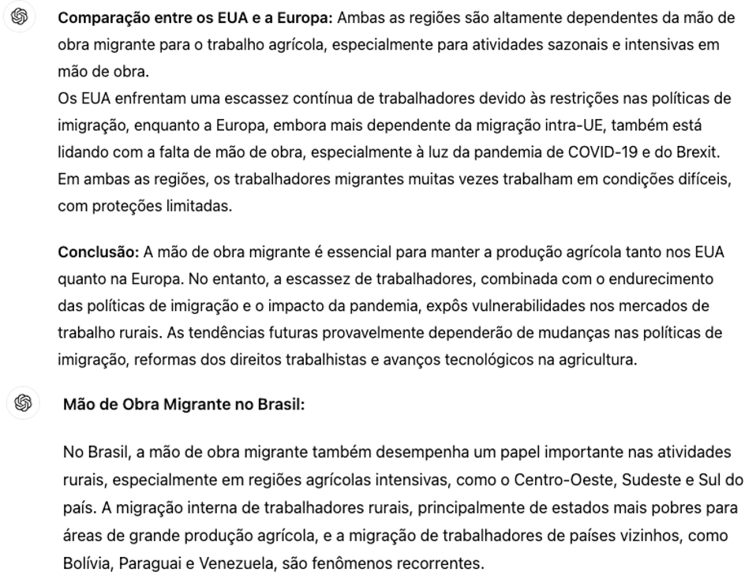
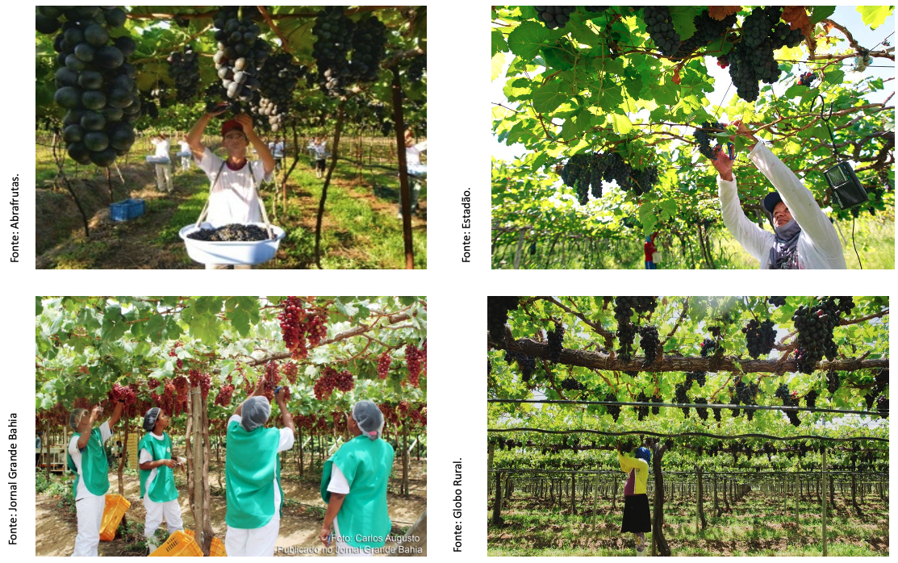

class: left, top

```{r setup, include=FALSE}
# Dependências dos slides/aula
library(knitr)          # CRAN v1.33
library(rmarkdown)      # CRAN v2.10
library(xaringan)       # CRAN v0.22
library(xaringanthemer) # CRAN v0.3.0
library(xaringanExtra)  # [github::gadenbuie/xaringanExtra] v0.5.5
library(RefManageR)     # CRAN v1.3.0
library(ggplot2)        # CRAN v3.3.5
library(fontawesome)    # [github::rstudio/fontawesome] v0.1.0
library(pagedown)
library(kableExtra)
library(dplyr)
library(GetBCBData)
library(lubridate)
library(RcppRoll)
library(scales)
library(zoo)

# Opções de chunks
options(htmltools.dir.version = FALSE)
knitr::opts_chunk$set(
  echo       = FALSE,
  warning    = FALSE,
  message    = FALSE,
  fig.retina = 3,
  fig.width  = 11,
  fig.asp    = 0.618,
  out.width  = "100%",
  fig.align  = "center",
  comment    = "#"
  )

# Cores para gráficos
colors <- c(
  blue       = "#282f6b",
  red        = "#b22200",
  yellow     = "#eace3f",
  green      = "#224f20",
  purple     = "#5f487c",
  orange     = "#b35c1e",
  turquoise  = "#419391",
  green_two  = "#839c56",
  light_blue = "#3b89bc",
  gray       = "#666666"
  )
```

```{r xaringan, echo=FALSE}
# Tema da apresentação
xaringanthemer::style_mono_light(
  base_color                      = unname(colors["blue"]),
  title_slide_background_image    = params$logo_slides, 
  title_slide_background_size     = 12,
  title_slide_background_position = "bottom 10px right 20px",
  title_slide_background_color    = "white",
  title_slide_text_color          = unname(colors["blue"]),
  footnote_position_bottom        = "15px"
  )

# Opções extras do tema
xaringanExtra::use_progress_bar(
  color    = colors["blue"], 
  location = "bottom"
  )
xaringanExtra::use_extra_styles(
  hover_code_line         = TRUE,
  mute_unhighlighted_code = FALSE
  )
xaringanExtra::use_panelset()
```

```{css, echo=FALSE}
pre {
  white-space: pre-wrap;
  overflow-y: scroll !important;
  max-height: 45vh !important;
  overflow-x: auto;
  max-width: 100%;
}
```

```{r load_refs, echo=FALSE, eval=params$references}
# Configuração de citações
RefManageR::BibOptions(
  check.entries = FALSE,
  bib.style     = "authoryear",
  cite.style    = "authoryear",
  style         = "markdown",
  hyperlink     = FALSE,
  dashed        = FALSE
  )
if(params$references){
  temp_refbib <- tempdir()
  download.file(
    url      = params$references_path, 
    destfile = paste0(temp_refbib, "/references.bib"), 
    mode     = "wb"
    )
  myBib <- RefManageR::ReadBib(paste0(temp_refbib, "/references.bib"), check = FALSE)
  }

# Como citar?
# RefManageR::TextCite(myBib, "id_da_citacao")
```

```{r utils, echo=FALSE}
# Função que pega um arquivo .Rmd, condicionalmente o renderiza, 
# e embute o conteúdo do mesmo formatado como Markdown puro 
# no output do documento atual
print_rmd <- function(file, encoding = "UTF-8", render = TRUE){
  if(render){rmarkdown::render(input = file, quiet = TRUE)}
  rmd <- readLines(con = file, encoding = encoding)
  cat("```md\n")
  cat(rmd, sep = "\n")
  cat("```\n")
}
```

## O Mercado de Trabalho - A População Ocupada

```{python trab1, echo=FALSE, message=FALSE, out.width="82%"}
import numpy as np
import pandas as pd
from plotnine import ggplot, aes, geom_line, labs, scale_x_datetime, theme_minimal, theme, element_text

# Load the CSV files
dataa = pd.read_csv('dados/arquivo12a.csv', sep=';')
data = pd.read_csv('dados/arquivo12.csv', sep=';', skiprows=4)

# Remove rows with NaN values
data = data.dropna()
data = data.iloc[:, 1:]

# Assuming 'Valor' is the 6th column in 'dataa', based on your previous R code
populacao = dataa.iloc[:, 5]  # Select the 6th column (Python is 0-indexed)

# Add the 'populacao' column to the 'data' DataFrame
data = pd.concat([data, populacao], axis=1)

# Rename the 'populacao' column for clarity (optional but recommended)
data = data.rename(columns={data.columns[-1]: 'populacao'})

# Assuming 'populacao' is now the last column, reorder the columns
columns = ['populacao'] + [col for col in data.columns if col != 'populacao']

# Reorganize the DataFrame to move 'populacao' to the first position
data = data[columns]

# Calculate the required columns
pnea = data.iloc[:, 1] - data.iloc[:, 2]  # PNEA: PIA - PEA
pia_pop = (data.iloc[:, 1] / data.iloc[:, 0]) * 100  # PIA/Populacao
participacao = (data.iloc[:, 2] / data.iloc[:, 1]) * 100  # PEA/PIA
ocupacao_pia = (data.iloc[:, 3] / data.iloc[:, 1]) * 100  # PO/PIA
desemprego = (data.iloc[:, 4] / data.iloc[:, 2]) * 100  # PD/PEA

# Create the 'macro' DataFrame with the new calculated columns
macro = pd.concat([data.iloc[:, :5], pnea, pia_pop, participacao, ocupacao_pia, desemprego], axis=1)

# Rename the columns
macro.columns = ['Populacao', 'PIA', 'PEA', 'PO', 'PD', 'PNEA', 'PIA/POP', 'PARTICIPACAO', 'PO/PIA', 'DESEMPREGO']

# Now the 'macro' DataFrame contains the original and calculated columns

# Create a date range starting from March 2012 with a monthly frequency
macro['DATE'] = pd.date_range(start='2012-03-01', periods=len(macro), freq='M')

# Graph 1: População Ocupada (PO)
plot1 = (
    ggplot(macro, aes(x='DATE', y='PO')) +
    geom_line(color="darkblue", size=1.5) +
    labs(title='', x='Anos', y='Pop. Ocupada') +
    scale_x_datetime(date_breaks='1 year', date_labels='%Y') +  # Yearly breaks on x-axis
    theme_minimal() +
    theme(
        figure_size=(14, 8),
        legend_position="bottom",
        axis_text_x=element_text(size=18),
        axis_text_y=element_text(size=18)
    ) +
    labs(title="",
         caption = 'Dados: PNADc IBGE')
)

print(plot1)
```

---
class: left, top

## O Mercado de Trabalho - A Taxa de Desemprego

```{python trab2, echo=FALSE, message=FALSE, out.width="82%"}
# Graph 2: Desemprego
plot2 = (
    ggplot(macro, aes(x='DATE', y='DESEMPREGO')) +
    geom_line(color="red", size=1.5) +
    labs(title='', x='Anos', y='Taxa de Desemprego (%)') +
    scale_x_datetime(date_breaks='1 year', date_labels='%Y') +  # Yearly breaks on x-axis
    theme_minimal() +
    theme(
        figure_size=(14, 8),
        legend_position="bottom",
        axis_text_x=element_text(size=18),
        axis_text_y=element_text(size=18)
    ) +
    labs(title="",
         caption = 'Dados: PNADc IBGE')
)

print(plot2)
```

---
class: left, top

## O Mercado de Trabalho - Antes da Pandemia

### População Ocupada Desagregada % 

.pull-left[

```{python trab3, echo=FALSE, message=FALSE}
import pandas as pd
from plotnine import ggplot, aes, geom_bar, labs, theme_minimal, theme, element_text


datab = pd.read_csv('dados/arquivo12b.csv', sep=';', skiprows=4)

# Remove rows with NaN values
datab = datab.dropna()
datab = datab.iloc[:, 1:]

pesos_po1 = (datab.div(macro['PO'], axis=0)) * 100 # Divide all values of 'datab' by the 'PO' column of 'macro' and multiply by 100

# Rename the columns of pesos_po1 DataFrame
pesos_po1.columns = [
    "Privado com Carteira",
    "Privado sem Carteira",
    "Trabalhador Domestico",
    "Setor Publico",
    "Empregador",
    "Conta Propria",
    "Trabalhador Familiar Auxiliar"
]

# Get the mean values for each category (similar to colMeans in R)

#pesos_po1.to_csv('dados/pesos_po1.csv', index=False)

#mean_values = pesos_po1.mean()

pesos_po1_last5 = pesos_po1.tail(5)
mean_values_last5 = pesos_po1_last5.mean().reset_index()
mean_values_last5.columns = ['Category', 'Mean']

# Calculate the percentage for each category
mean_values_last5['Percentage'] = mean_values_last5['Mean'] / mean_values_last5['Mean'].sum() * 100

mean_values_last5.to_csv('dados/mean_values_last5.csv', index=False) 
```

```{python trab4, echo=FALSE, message=FALSE}
import pandas as pd
from plotnine import ggplot, aes, geom_bar, labs, theme_minimal, theme, element_text

datab = pd.read_csv('dados/arquivo12b.csv', sep=';', skiprows=4)

# Convert the "Unnamed: 0" column to datetime
datab['period'] = pd.to_datetime(datab['Unnamed: 0'].str[:3] + ' ' + datab['Unnamed: 0'].str[-4:], format='%b %Y')

# Drop rows where the year is greater than 2020
datab_filtered = datab[datab['period'].dt.year <= 2020]

# Drop the original "Unnamed: 0" column
datab_filtered = datab_filtered.drop(columns=['Unnamed: 0'])

# Display the filtered DataFrame
#print(datab_filtered)

# Filtrar Macro antes da Pandemia
macro2 = macro

# Drop rows where the year is greater than 2020
macro2_filtered = macro2[macro2['DATE'].dt.year <= 2020]

# Select all columns from datab_filtered except the last one
datab_filtered_no_period = datab_filtered.iloc[:, :-1]

# Ensure that the index of both DataFrames matches; you can reset the index if needed
datab_filtered_no_period = datab_filtered_no_period.reset_index(drop=True)
macro2_filtered_po = macro2_filtered['PO'].reset_index(drop=True)  # Assuming "PO" refers to the PIA column

# Perform the division and multiply by 100
pesos_po2 = datab_filtered_no_period.div(macro2_filtered_po, axis=0) * 100

# Display the resulting DataFrame
#print(pesos_po2)


# Rename the columns of pesos_po1 DataFrame
pesos_po2.columns = [
    "Privado com Carteira",
    "Privado sem Carteira",
    "Trabalhador Domestico",
    "Setor Publico",
    "Empregador",
    "Conta Propria",
    "Trabalhador Familiar Auxiliar"
]

pesos_po2.to_csv('dados/pesos_po2.csv', index=False) 

```

```{r trab5, echo=FALSE, message=FALSE, out.width="120%"}
pesos_po2 <- read.csv2('dados/pesos_po2.csv',
                       header=T, sep=',', dec='.')

# Adjust the margins and text size
par(mar = c(2, 2, 2, 2), cex = 1.5)  # Adjust margins and increase text size

### Gerar Grafico
pie(colMeans(pesos_po2), col=c('red','black','blue','darkblue',
                               'darkgreen', '367', '556'),
    main='')
```

]

.pull-right[

| Categorias                      | Porcentagem |
|:------------------------------|:----------:|
| Privado com Carteira           |   38.53    |
| Privado sem Carteira           |   11.92    |
| Trabalhador Domestico          |    6.41    |
| Setor Publico                  |   12.25    |
| Empregador                     |    4.33    |
| Conta Propria                  |   24.01    |
| Trabalhador Familiar Auxiliar   |    2.55    |

**Fonte**: PNADc/IBGE.

]

---
class: left, top

## O Mercado de Trabalho - Atual

### População Ocupada Desagregada % 

.pull-left[

```{r trab6, echo=FALSE, message=FALSE, out.width="120%"}
mean_values_last5 <- read.csv2('dados/mean_values_last5.csv',
                       header=T, sep=',', dec=',')

# Ensure Percentage column is numeric
mean_values_last5$Percentage <- as.numeric(mean_values_last5$Percentage)

# Adjust the margins and text size
par(mar = c(2, 2, 2, 2), cex = 1.5)  # Adjust margins and increase text size

# Create the pie chart
pie(mean_values_last5$Percentage, 
    col=c('red','black','blue','darkblue', 'darkgreen', 'yellow', 'pink'),  # Colors for each category
    labels=mean_values_last5$Category, 
    main='')
```

]

.pull-right[

| Categorias                    | Porcentagem | % Var. |
|:------------------------------|:-----------:|:--------:|
| Privado com Carteira           |    37.82    |  -1.85%  |
| Privado sem Carteira           |    13.49    | +13.17%  |
| Trabalhador Domestico          |     5.78    |  -9.83%  |
| Setor Publico                  |    12.28    |  +0.24%  |
| Empregador                     |     4.16    |  -3.93%  |
| Conta Propria                  |    25.15    |  +4.75%  |
| Trabalhador Familiar Auxiliar  |     1.32    | -48.24%  |

**Fonte**: PNADc/IBGE.

]

---
class: center, top

## Variação Interanual dos Rendimentos

```{python trab7, echo=FALSE, message=FALSE, out.width="82%"}
import pandas as pd
from plotnine import *

anual = (
    pd.read_csv(filepath_or_buffer="dados/anual_data.csv", parse_dates=['time'], sep=",", decimal=".")
    )

# Plot using plotnine
anual_plot = (
    ggplot(anual, aes(x='time', y='anual')) +
    geom_line(color="darkblue", size=1.5) +
    scale_x_datetime(date_breaks='1 year', date_labels='%Y') +
    labs(x='Anos', y='Variação % Interanual') +
    theme_minimal() +
    theme(
        figure_size=(14, 8),
        legend_position="bottom",
        axis_text_x=element_text(size=16),
        axis_text_y=element_text(size=16)
    ) +
    labs(title="",
         caption = 'Dados: PNADc IBGE')
)

# Show the plot
print(anual_plot)   
```

---
class: center

### A COBERTURA E USO DA TERRA EM PERNAMBUCO.

```{r, echo=FALSE, out.width="55%"}

```
Fonte: MapBiomas, 2024.

---
class: center

### A COBERTURA E USO DA TERRA NA BAHIA.

```{r, echo=FALSE, out.width="55%"}

```
Fonte: MapBiomas, 2024.

---
class: center

### EVOLUÇÃO DOS EMPREGOS RURAIS EM PERNAMBUCO.

```{r, echo=FALSE, out.width="68%"}

```


---
class: center

### EVOLUÇÃO DOS EMPREGOS RURAIS NA BAHIA.

```{r, echo=FALSE, out.width="68%"}

```

---
class: center

### ESCASSEZ DE MÃO DE OBRA NO MUNDO E NO BRASIL.

```{r, echo=FALSE, out.width="63%"}

```

---
class: center

### GERAÇÃO DE EMPREGOS NA FRUTICULTURA DO VALE

```{r, echo=FALSE}
knitr::include_graphics("imgs/trab1.png")
```

---
class: center

### GERAÇÃO DE EMPREGOS NA FRUTICULTURA DO VALE

```{r, echo=FALSE, out.width="80%"}

```

---
class: left, top

## Estoque de Empregos na Uva: Bahia e Pernambuco

```{python trab8, echo=FALSE, message=FALSE, out.width="82%"}
import pandas as pd
import numpy as np
from plotnine import *

trab_ano = (
    pd.read_csv(filepath_or_buffer="dados/estoque_ano.csv", parse_dates=['anos'], sep=";")
    )
    
# Create the 'sum_uva' column for the line plot (sum of uva_pe and uva_ba)
trab_ano['sum_uva'] = trab_ano['uva_pe'] + trab_ano['uva_ba']

# Melt the DataFrame for uva_pe and uva_ba
df_melted = pd.melt(trab_ano[['anos', 'uva_pe', 'uva_ba']], id_vars='anos', 
                    var_name='category', value_name='value')

# Define the plot
p = (ggplot() +
     # Bar plot for uva_pe and uva_ba side by side
     geom_col(df_melted, aes(x='anos', y='value', fill='category'), position='dodge', alpha=0.7) +
     # Line plot for the sum of uva_pe and uva_ba
     geom_line(trab_ano, aes(x='anos', y='sum_uva', color='"Total Uva"'), size=1.5) +
     # Colors for the columns and line
     scale_fill_manual(values=['darkblue', 'darkgreen'], labels=['Uva BA', 'Uva PE']) +
     scale_color_manual(values=['Red']) +
     scale_x_datetime(date_breaks='1 year', date_labels='%Y') +
     # Labels
     labs(y='Quantidade de Empregos',
          x='Anos',
          fill='Estados',
          color='Quantidade Total',
          caption="FONTE: CAGED reprocessados pelos Obsrevatórios de Mercado da Embrapa") +
     # Theme
     theme_minimal()+
    theme(
        figure_size=(14, 8),
        legend_position="bottom",
        axis_text_x=element_text(size=16),
        axis_text_y=element_text(size=16)
    )
 )

# Display the plot
print(p)

```

---
class: left, top

## Estoque de Empregos na Manga: Bahia e Pernambuco

```{python trab9, echo=FALSE, message=FALSE, out.width="82%"}

# Create the 'sum_uva' column for the line plot (sum of uva_pe and uva_ba)
trab_ano['sum_manga'] = trab_ano['manga_pe'] + trab_ano['manga_ba']

# Melt the DataFrame for uva_pe and uva_ba
df_melted = pd.melt(trab_ano[['anos', 'manga_pe', 'manga_ba']], id_vars='anos', 
                    var_name='category', value_name='value')

# Define the plot
p = (ggplot() +
     # Bar plot for manga_pe and manga_ba side by side
     geom_col(df_melted, aes(x='anos', y='value', fill='category'), position='dodge', alpha=0.7) +
     # Line plot for the sum of manga_pe and manga_ba
     geom_line(trab_ano, aes(x='anos', y='sum_manga', color='"Total Manga"'), size=1.5) +
     # Colors for the columns and line
     scale_fill_manual(values=['darkblue', 'darkgreen'], labels=['Manga BA', 'Manga PE']) +
     scale_color_manual(values=['Red']) +
     scale_x_datetime(date_breaks='1 year', date_labels='%Y') +
     # Labels
     labs(y='Quantidade de Empregos',
          x='Anos',
          fill='Estados',
          color='Quantidade Total',
          caption="FONTE: CAGED reprocessados pelos Obsrevatórios de Mercado da Embrapa") +
     # Theme
     theme_minimal()+
    theme(
        figure_size=(14, 8),
        legend_position="bottom",
        axis_text_x=element_text(size=16),
        axis_text_y=element_text(size=16)
    )
 )

# Display the plot
print(p)

```


---
class: center

### Empregos no Agronegócio do Vale sobre o Total

```{python trab10a, echo=FALSE, message=FALSE, out.width="85%"}
import pandas as pd
from plotnine import ggplot, aes, geom_col, geom_text, labs, scale_fill_manual, scale_y_continuous, scale_x_date, theme_minimal, theme, element_text, element_blank
from mizani.formatters import date_format
from pandas.plotting import register_matplotlib_converters
import matplotlib.pyplot as plt

register_matplotlib_converters()

# Reading the CSV file
dados1 = pd.read_csv('dados/julho_2024.csv', sep=";", decimal=".")

# Adding the date column
dados1['date'] = pd.date_range(start='2021-01-01', periods=len(dados1), freq='MS')

# Selecting the necessary columns and renaming them to match the R code
dados1a = dados1[['date', 'Variavel', 'Proporcao']].rename(columns={'Variavel': 'variable', 'Proporcao': 'value'})

# Creating the plot
g1a = (ggplot(dados1a, aes(x='date', y='value')) +
      geom_col(aes(fill='"variable"')) +
      scale_fill_manual(values=["blue"]) +  # Change the bar color
      labs(y="Proporção Agro/Total (%)", x="Meses dos Anos",
           caption="Fonte: CAGED reprocessado pelos Observatórios de Manga e Uva da Embrapa, 2024.") +
      scale_y_continuous(breaks=range(0, 110, 10)) +  # Adjust y-axis breaks
      scale_x_date(date_breaks="1 month", labels=date_format("%m/%Y"), expand=(0, 0)) +
      geom_text(aes(label='value'), ha='center', va='bottom') +
      theme_minimal() +
      theme(axis_text_x=element_text(angle=45, size=12, ha='right'),
            axis_text_y=element_text(size=14),
            axis_title_x=element_text(size=14, weight='bold'),
            axis_title_y=element_text(size=14, weight='bold'),
            panel_grid_major=element_blank(),
            panel_grid_minor=element_blank(),
            plot_caption=element_text(ha='left', size=14),
            legend_position='none',
            figure_size=(14, 8),)  # Hides the legend
     )

# Show the plot
print(g1a)

```

---
class: center

### Empregos gerados na Manga por Genero em 2023

```{r echo=FALSE, message=FALSE, warning=FALSE, out.width="80%"}

subclasse_positivos <- read.csv2('dados/subclasse_positivos.csv',
                       header=T, sep=';', dec=',')

# Creating the histogram for the entire pooled dataset
g2 <- ggplot(data = subclasse_positivos, aes(x = sexo, y = after_stat(count)))  +
  geom_bar(fill='steelblue') +
  labs(y= "Contratados Manga - VSF", x= "Gênero", title='', caption = "Fonte: CAGED reprocessado pelos Observatórios de Manga e Uva da Embrapa, 2024.") +
  theme_minimal() + # Definindo tema
  theme(axis.text.x = element_text(angle=0, hjust=0.5, size=10, margin = margin(b=20)),
        axis.text.y = element_text(hjust=1, size=10, margin = margin(l=20)),
        axis.title.x = element_text(size=10, face="bold", margin = margin(b=20)),
        axis.title.y = element_text(size=10, face="bold", margin = margin(l=20)),
        panel.grid.major = element_blank(),
        panel.grid.minor = element_blank(),
        plot.title = element_text(hjust = 0.5, size=12),
        plot.caption = element_text(hjust = 0, size=12),
        legend.position = "bottom", legend.title = element_blank(),
        legend.text = element_text(size=12)) # Definindo posição da legenda

g2

```

---
class: center

### Empregos gerados na Manga por Idade em 2023

```{r echo=FALSE, message=FALSE, out.width="80%"}
# Creating the histogram for the age distribution
g3 <- ggplot(data=subclasse_positivos, aes(x=idade)) +
  geom_histogram(binwidth=3, fill="#69b3a2", color="#e9ecef", alpha=0.9) +
  scale_x_continuous(limits=c(18, 65), n.breaks=10, expand=expansion(add=c(0,0.5))) +
  labs(y="Contratados Manga - VSF", x="Faixa de Idades", 
       title="", 
       caption="Fonte: CAGED reprocessado pelos Observatórios de Manga e Uva da Embrapa, 2024.") +
  theme_minimal() +
  theme(axis.text.x = element_text(angle=0, hjust=0.5, size=10, margin=margin(b=20)),
        axis.text.y = element_text(hjust=1, size=10, margin=margin(l=20)),
        axis.title.x = element_text(size=10, face="bold", margin=margin(b=20)),
        axis.title.y = element_text(size=10, face="bold", margin=margin(l=20)),
        panel.grid.major = element_blank(),
        panel.grid.minor = element_blank(),
        plot.title = element_text(hjust=0.5, size=12),
        plot.caption = element_text(hjust=0, size=12),
        legend.position = "bottom", 
        legend.title = element_blank(),
        legend.text = element_text(size=12)) # Definindo posição da legenda

g3

```

---
class: center

### Empregos gerados na Manga por Escolaridade em 2023

```{r echo=FALSE, message=FALSE, out.width="80%"}

# Convert 'grau_instrucao' back to an ordered factor
subclasse_positivos <- mutate(subclasse_positivos,
                grau_instrucao = factor(grau_instrucao, 
                                        levels = c("Analfabeto", "Até 5ª Incompleto", 
                                                   "5ª Completo Fundamental", "6ª a 9ª Fundamental", 
                                                   "Fundamental Completo", "Médio Incompleto", 
                                                   "Médio Completo", "Superior Incompleto", 
                                                   "Superior Completo", "Mestrado", "Doutorado", 
                                                   "Pós-Graduação completa"),
                                        ordered = TRUE))

g4 <- ggplot(data = subclasse_positivos, aes(x = grau_instrucao, y = after_stat(count))) +
  geom_bar(fill='steelblue') +
  scale_y_continuous(limits=c(0, 5000), n.breaks=10, expand=expansion(add=c(0,0.5))) +
  labs(y= "Contratados Manga - VSF", x= "Graus de Instrução", title='', caption = "Fonte: CAGED reprocessado pelos Observatórios de Manga e Uva da Embrapa, 2024.") +
  theme_minimal() +
  theme(axis.text.x = element_text(angle=30, hjust=1, size=10, margin=margin(b=20)),
        axis.text.y = element_text(hjust=1, size=14, margin=margin(l=20)),
        axis.title.x = element_text(size=14, face="bold", margin=margin(b=20)),
        axis.title.y = element_text(size=14, face="bold", margin=margin(l=20)),
        panel.grid.major = element_blank(),
        panel.grid.minor = element_blank(),
        plot.title = element_text(hjust=0.5, size=16, face="italic"),
        plot.caption = element_text(hjust=0, size=12),
        legend.position = "bottom", legend.title = element_blank(),
        legend.text = element_text(size=12)) # Definindo posição da legenda

g4
```

---
class: center

### Empregos gerados na Uva por Genero em 2023

```{r echo=FALSE, message=FALSE, warning=FALSE, out.width="80%"}

subclasse_positivos <- read.csv2('dados/subclasse_positivos_uva.csv',
                       header=T, sep=';', dec=',')

# Creating the histogram for the entire pooled dataset
g2 <- ggplot(data = subclasse_positivos, aes(x = sexo, y = after_stat(count)))  +
  geom_bar(fill='purple') +
  labs(y= "Contratados Uva - VSF", x= "Gênero", title='', caption = "Fonte: CAGED reprocessado pelos Observatórios de Manga e Uva da Embrapa, 2024.") +
  theme_minimal() + # Definindo tema
  theme(axis.text.x = element_text(angle=0, hjust=0.5, size=10, margin = margin(b=20)),
        axis.text.y = element_text(hjust=1, size=10, margin = margin(l=20)),
        axis.title.x = element_text(size=10, face="bold", margin = margin(b=20)),
        axis.title.y = element_text(size=10, face="bold", margin = margin(l=20)),
        panel.grid.major = element_blank(),
        panel.grid.minor = element_blank(),
        plot.title = element_text(hjust = 0.5, size=12),
        plot.caption = element_text(hjust = 0, size=12),
        legend.position = "bottom", legend.title = element_blank(),
        legend.text = element_text(size=12)) # Definindo posição da legenda

g2

```

---
class: center

### Empregos gerados na Uva por Idade em 2023

```{r echo=FALSE, message=FALSE, out.width="80%"}
# Creating the histogram for the age distribution
g3 <- ggplot(data=subclasse_positivos, aes(x=idade)) +
  geom_histogram(binwidth=3, fill="#69b3a2", color="#e9ecef", alpha=0.9) +
  scale_x_continuous(limits=c(18, 65), n.breaks=10, expand=expansion(add=c(0,0.5))) +
  labs(y="Contratados Uva - VSF", x="Faixa de Idades", 
       title="", 
       caption="Fonte: CAGED reprocessado pelos Observatórios de Manga e Uva da Embrapa, 2024.") +
  theme_minimal() +
  theme(axis.text.x = element_text(angle=0, hjust=0.5, size=10, margin=margin(b=20)),
        axis.text.y = element_text(hjust=1, size=10, margin=margin(l=20)),
        axis.title.x = element_text(size=10, face="bold", margin=margin(b=20)),
        axis.title.y = element_text(size=10, face="bold", margin=margin(l=20)),
        panel.grid.major = element_blank(),
        panel.grid.minor = element_blank(),
        plot.title = element_text(hjust=0.5, size=12),
        plot.caption = element_text(hjust=0, size=12),
        legend.position = "bottom", 
        legend.title = element_blank(),
        legend.text = element_text(size=12)) # Definindo posição da legenda

g3

```

---
class: center

### Empregos gerados na Uva por Escolaridade em 2023

```{r echo=FALSE, message=FALSE, out.width="80%"}

# Convert 'grau_instrucao' back to an ordered factor
subclasse_positivos <- mutate(subclasse_positivos,
                grau_instrucao = factor(grau_instrucao, 
                                        levels = c("Analfabeto", "Até 5ª Incompleto", 
                                                   "5ª Completo Fundamental", "6ª a 9ª Fundamental", 
                                                   "Fundamental Completo", "Médio Incompleto", 
                                                   "Médio Completo", "Superior Incompleto", 
                                                   "Superior Completo", "Mestrado", "Doutorado", 
                                                   "Pós-Graduação completa"),
                                        ordered = TRUE))

g4 <- ggplot(data = subclasse_positivos, aes(x = grau_instrucao, y = after_stat(count))) +
  geom_bar(fill='purple') +
  scale_y_continuous(limits=c(0, 11000), n.breaks=10, expand=expansion(add=c(0,0.5))) +
  labs(y= "Contratados Uva - VSF", x= "Graus de Instrução", title='', caption = "Fonte: CAGED reprocessado pelos Observatórios de Manga e Uva da Embrapa, 2024.") +
  theme_minimal() +
  theme(axis.text.x = element_text(angle=30, hjust=1, size=10, margin=margin(b=20)),
        axis.text.y = element_text(hjust=1, size=14, margin=margin(l=20)),
        axis.title.x = element_text(size=14, face="bold", margin=margin(b=20)),
        axis.title.y = element_text(size=14, face="bold", margin=margin(l=20)),
        panel.grid.major = element_blank(),
        panel.grid.minor = element_blank(),
        plot.title = element_text(hjust=0.5, size=16, face="italic"),
        plot.caption = element_text(hjust=0, size=12),
        legend.position = "bottom", legend.title = element_blank(),
        legend.text = element_text(size=12)) # Definindo posição da legenda

g4
```

---
class: center

### Empregos gerados por Idade em 2024 na Fruticultura do Vale.

```{r echo=FALSE, message=FALSE, out.width="80%"}

subclasse_positivos <- read.csv2('dados/subclasse_positivos_2024.csv',
                       header=T, sep=';', dec=',')

# Creating the histogram for the age distribution
g3 <- ggplot(data=subclasse_positivos, aes(x=idade)) +
  geom_histogram(binwidth=3, fill="gold", color="#e9ecef", alpha=0.9) +
  scale_x_continuous(limits=c(18, 65), n.breaks=10, expand=expansion(add=c(0,0.5))) +
  labs(y="Contratados Manga e Uva - VSF", x="Faixa de Idades", 
       title="", 
       caption="Fonte: CAGED reprocessado pelos Observatórios de Manga e Uva da Embrapa, 2024.") +
  theme_minimal() +
  theme(axis.text.x = element_text(angle=0, hjust=0.5, size=10, margin=margin(b=20)),
        axis.text.y = element_text(hjust=1, size=10, margin=margin(l=20)),
        axis.title.x = element_text(size=10, face="bold", margin=margin(b=20)),
        axis.title.y = element_text(size=10, face="bold", margin=margin(l=20)),
        panel.grid.major = element_blank(),
        panel.grid.minor = element_blank(),
        plot.title = element_text(hjust=0.5, size=12),
        plot.caption = element_text(hjust=0, size=12),
        legend.position = "bottom", 
        legend.title = element_blank(),
        legend.text = element_text(size=12)) # Definindo posição da legenda

g3

```

---
class: center

### Empregos gerados por Escolaridade em 2024 na Fruticultura do Vale.

```{r echo=FALSE, message=FALSE, out.width="80%"}

# Convert 'grau_instrucao' back to an ordered factor
subclasse_positivos <- mutate(subclasse_positivos,
                grau_instrucao = factor(grau_instrucao, 
                                        levels = c("Analfabeto", "Até 5ª Incompleto", 
                                                   "5ª Completo Fundamental", "6ª a 9ª Fundamental", 
                                                   "Fundamental Completo", "Médio Incompleto", 
                                                   "Médio Completo", "Superior Incompleto", 
                                                   "Superior Completo", "Mestrado", "Doutorado", 
                                                   "Pós-Graduação completa"),
                                        ordered = TRUE))

g4 <- ggplot(data = subclasse_positivos, aes(x = grau_instrucao, y = after_stat(count))) +
  geom_bar(fill='gold') +
  scale_y_continuous(limits=c(0, 10000), n.breaks=10, expand=expansion(add=c(0,0.5))) +
  labs(y= "Contratados Manga e Uva - VSF", x= "Graus de Instrução", title='', caption = "Fonte: CAGED reprocessado pelos Observatórios de Manga e Uva da Embrapa, 2024.") +
  theme_minimal() +
  theme(axis.text.x = element_text(angle=30, hjust=1, size=10, margin=margin(b=20)),
        axis.text.y = element_text(hjust=1, size=14, margin=margin(l=20)),
        axis.title.x = element_text(size=14, face="bold", margin=margin(b=20)),
        axis.title.y = element_text(size=14, face="bold", margin=margin(l=20)),
        panel.grid.major = element_blank(),
        panel.grid.minor = element_blank(),
        plot.title = element_text(hjust=0.5, size=16, face="italic"),
        plot.caption = element_text(hjust=0, size=12),
        legend.position = "bottom", legend.title = element_blank(),
        legend.text = element_text(size=12)) # Definindo posição da legenda

g4
```


---
class: left, top

# EM RESUMO

### Existe um fenômeno mundial de redução da população e dos empregos no campo. 

### Empregos no campo concorrem com os empregos na cidade pela atual facilidade de locomoção das pessoas.

### O acesso à educação em nível médio, técnico e superior é muito mais fácil, atualmente, no interior do Nordeste.

### Com mais escolaridade e mais facilidade de ir para a cidade, as pessoas não querem trabalhar no campo. Dificuldade tanto para trabalhadores quanto para se fazer sucessão familiar.

---
class: left, top

# EM RESUMO

### As pessoas querem consumir mais no curto prazo e para isso precisam aumentar sua renda. 

### Todos os setores da economia já passaram por dificuldades com mão de obra depois da Revolução Industrial. O Agronegócio em geral, no Brasil, tem reduzido o problema com uso de tecnologia.

### A Fruticultura do Vale do São Francisco tem características que dificultam a substituição de pessoas por máquinas. 

### Contudo, não significa que seja impossível ocorrer. Se drones pulverizam e colhem maças, eles podem colher mangas. 

---
class: left, top

# EM RESUMO

### Se máquinas com Inteligência Artificial conseguem monitorar áreas em relação `aàs moscas das frutas, conseguem identificar o tipo de inseto que está na armadilha, ela pode ser treinada para identificar problemas em cachos de uvas. 

### Ela vai conseguir analisar todos os problemas do cacho de uva e executar as tarefas de uma forma mais precisa e mais rápida. 

### Do ponto de vista sindical, se tem um problema ao reduzir a quantidade de pessoas contratado na fruticultura. Enfraquece o Sindicato dos trabalhadores(as). 

---
class: left, top

# EM RESUMO

### Dado o custo elevado do desenvolvimento tecnológico, a solução de reduzir a demanda por trabalho, não chega no curto prazo.

### O que ocorre quando existe um desequilíbrio entre a Oferta e a Demanda é o ajuste pelo preço, ou seja, o salário, só que isto impacta a competitividade, que já é baixa. 

### A oferta de trabalho tem aumentado, mas em uma velocidade menor do que as necessidades de contratação, que cresce muito rápido pela forte expansão de área plantada na região.

---
class: center, middle

# OBRIGADO!

João Ricardo F. de Lima <br>
Email: joao.lima@prof.facape.br <br>
IG: jotaerre.econ


Telefones:<br>
87-99961-5799 